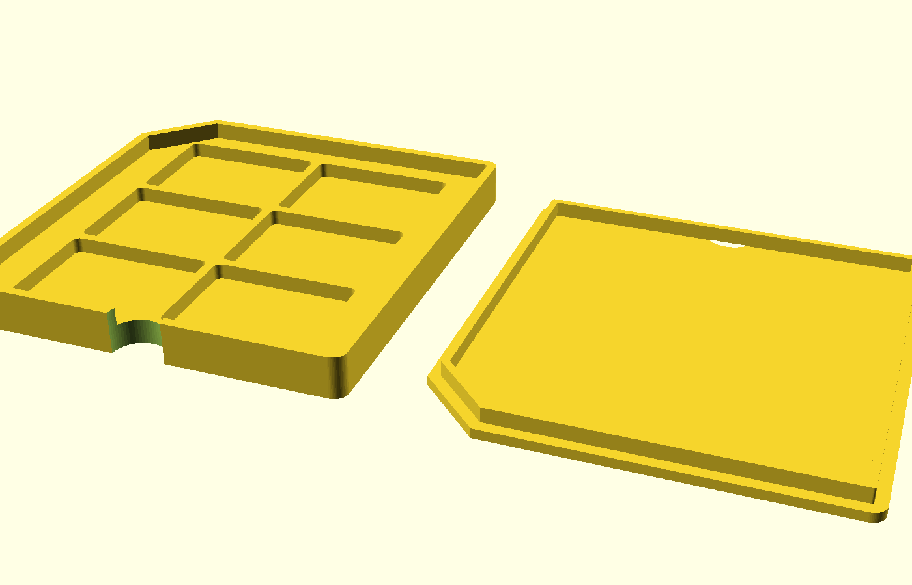
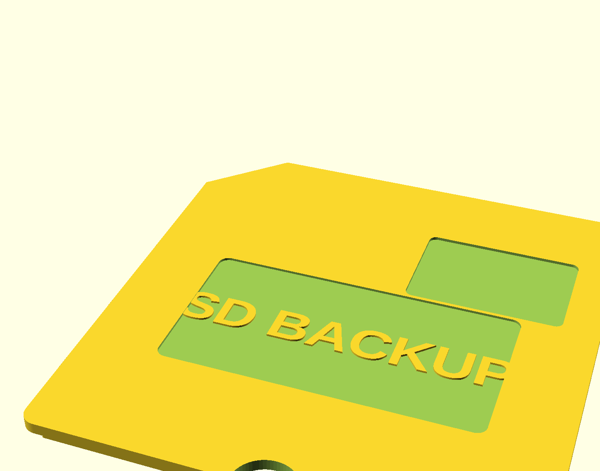

# 3D Floppy Disk SD Card Save

Ein 3D-druckbares SD-Karten-Aufbewahrungsbox im Design einer klassischen 3,5"-Diskette, angelehnt an das Referenzfoto. Das Modell besteht aus zwei Teilen: einem Unterteil (Tray) mit 6 Fächern für SD-Karten und einem abnehmbaren Deckel im Diskettenlook (mit Etikettenfeld und "Schutzschieber"-Optik), der über einen Klemmsteg auf das Unterteil aufgesteckt wird.




## Dateien

- `model/floppy_sd_case.scad` — parametrisches OpenSCAD-Quellmodell (zum Anpassen)
- `stl/floppy_sd_case_base.stl` — Unterteil, druckfertig ausgerichtet
- `stl/floppy_sd_case_lid.stl` — Deckel, druckfertig ausgerichtet (Steg zeigt nach oben)
- `stl/floppy_sd_case_both.stl` — beide Teile nebeneinander auf einer Druckplatte

## Funktionsweise

- Das Unterteil hat 6 Fächer (2 Spalten × 3 Reihen), jedes ausgelegt für eine SD-Karte bzw. einen microSD-Adapter (32 × 24 mm, ca. 1,2 mm Spiel).
- Der Deckel wird von oben aufgesteckt: Ein umlaufender Steg an der Deckelunterseite klemmt sich in den Rand des Unterteils (Presspassung, kein Klebstoff/Scharnier nötig).
- An der Vorderkante ist bei beiden Teilen eine kleine Kerbe eingearbeitet, um den Deckel bequem mit dem Fingernagel abheben zu können.
- Der Deckel hat eine vertiefte Etikettenfläche mit erhabener Beschriftung ("SD BACKUP", änderbar) sowie eine Vertiefung, die den "Schutzschieber" der echten Diskette andeutet.

## Drucken

Kein Support nötig — beide Teile liegen bereits druckfertig flach auf der Druckplatte.

Empfohlene Einstellungen (PLA/PETG):
- Schichthöhe: 0,2 mm
- Wandlinien: 3
- Infill: 15–20 %
- Kein Support, kein Raft nötig (ggf. Brim für bessere Haftung der dünnen Aussenwände)
- Die Fach-Stege und der Klemmsteg sind ca. 1,6–2,2 mm dick — mit einer 0,4 mm Düse gut druckbar

Falls euer Druckbett kleiner als ca. 200 × 100 mm ist, druckt `floppy_sd_case_base.stl` und `floppy_sd_case_lid.stl` einzeln statt der `_both`-Datei.

## Passgenauigkeit anpassen

Sitzt der Deckel zu stramm oder zu locker, in `model/floppy_sd_case.scad` anpassen und die STLs neu exportieren:

- `fit_clearance` (Standard 0,3 mm) — Spiel zwischen Deckelsteg und Trayrand. Bei zu strammem Sitz erhöhen (z. B. 0,4–0,5 mm), je nach Drucker/Toleranz.
- `label_text` — eigener Text fürs Etikett (z. B. "NAS BACKUP" wie im Referenzfoto)
- `cols` / `rows` — Anzahl der Kartenfächer
- `card_w` / `card_l` — Kartenmasse, falls andere Formate (z. B. CFexpress) verstaut werden sollen

Neu exportieren mit OpenSCAD (CLI-Beispiel):

```bash
openscad -o stl/floppy_sd_case_base.stl -D 'part="base"' model/floppy_sd_case.scad
openscad -o stl/floppy_sd_case_lid.stl  -D 'part="lid"'  model/floppy_sd_case.scad
```

Alternativ die Datei einfach in der OpenSCAD-GUI öffnen, `part` oben im Customizer umschalten und über *Datei → Export → Export as STL* exportieren.
