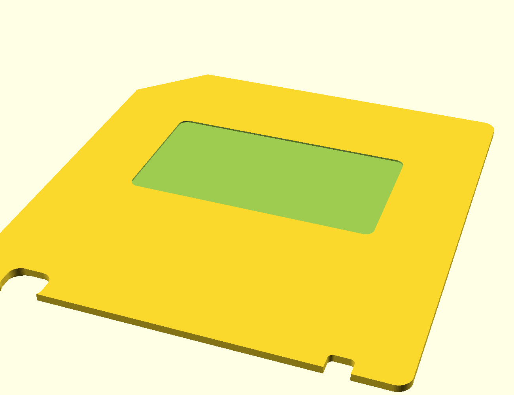
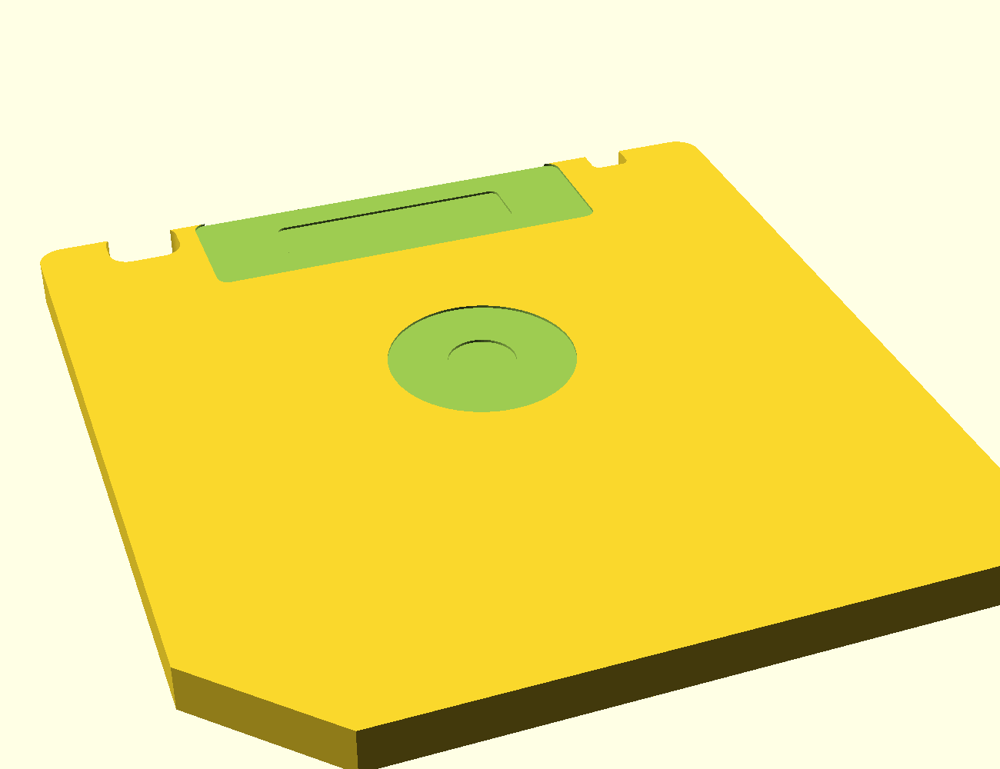

# 3D Floppy Disk SD Card Save

Ein 3D-druckbares SD-Karten-Aufbewahrungsbox im Design einer klassischen 3,5"-Diskette, angelehnt an das Referenzfoto. Das Modell besteht aus zwei Teilen: einem Unterteil (Tray) mit Fächern für 2 SD- und 6 microSD-Karten und einem schlichten, unbeschrifteten Deckel, der über einen Klemmsteg aufgesteckt wird. Beide Teile sind auf minimale Wandstärke ausgelegt, bei der das Ganze noch stabil bleibt — geschlossen ist die Box nur ca. 7 mm dick.





## Dateien

- `model/floppy_sd_case.scad` — parametrisches OpenSCAD-Quellmodell (zum Anpassen)
- `stl/floppy_sd_case_base.stl` — Unterteil, druckfertig ausgerichtet
- `stl/floppy_sd_case_lid.stl` — Deckel, druckfertig ausgerichtet (Steg zeigt nach oben)
- `stl/floppy_sd_case_both.stl` — beide Teile nebeneinander auf einer Druckplatte

## Funktionsweise

- Das Unterteil hat 2 Fächer für volle SD-Karten (32 × 24 mm) nebeneinander sowie 6 kleinere Fächer für microSD-Karten (15 × 11 mm) im 3×2-Raster darunter — insgesamt 8 Karten.
- Die microSD-Fächer sind flacher als die SD-Fächer (an die geringere Kartendicke angepasst), damit trotzdem alle Karten sicher sitzen und zum Herausnehmen leicht überstehen.
- Der Deckel wird von oben aufgesteckt: Ein umlaufender Steg an der Deckelunterseite klemmt sich in den Rand des Unterteils (Presspassung, kein Klebstoff/Scharnier nötig). Der Deckel ist bewusst schlicht gehalten, ohne Beschriftung oder Gravur.
- Die Kontur ist an eine echte 3,5"-Diskette angelehnt: abgeschrägte Ecke oben links, plus die beiden Aussparungen an der Einschubkante (Schreibschutz-Schieber links, Sensorloch rechts). Die linke, größere Aussparung dient zugleich als Fingergriff, um den Deckel abzuheben. Diese Konturen sind reine Ausschnitte in der Grundfläche und machen die Box nicht dicker.
- Auf dem Deckel (Vorderseite) ist ein flach vertieftes, leeres Etikettenfeld für einen eigenen Aufkleber vorgesehen — ohne Gravur/Schrift.
- Auf der Unterseite des Unterteils (Rückseite) sind, wie bei einer echten Diskette, eine runde Nabe (mittig) und eine rechteckige "Alu-Abdeckung" mit Fenster nahe der Einschubkante angedeutet — beides rein dekorative, flache Vertiefungen (max. 0,6 mm).
- Alle drei Deko-Elemente sind reine Vertiefungen und liegen auf der jeweiligen Außenfläche, weit genug von den Kartenfächern entfernt in der Bauteiltiefe (Boden bleibt überall mind. 1 mm stark) — die Box wird dadurch nicht dicker, an den Kartenfächern musste nichts verschoben werden.
- Geschlossene Gesamthöhe ca. 7,1 mm, Wand-/Bodenstärke 1,6 mm — dünn, aber mit genug Materialstärke für einen stabilen Druck.

## Drucken

Kein Support nötig — beide Teile liegen bereits druckfertig flach auf der Druckplatte.

Empfohlene Einstellungen (PLA/PETG):
- Schichthöhe: 0,16–0,2 mm
- Wandlinien: 4 (bei 0,4 mm Düse ≈ 1,6 mm Wandstärke passend zum Modell)
- Infill: 20–25 % (bei den dünnen Wänden sorgt das für ausreichend Stabilität)
- Kein Support, kein Raft nötig (ggf. Brim für bessere Haftung der dünnen Aussenwände)

Falls euer Druckbett kleiner als ca. 200 × 100 mm ist, druckt `floppy_sd_case_base.stl` und `floppy_sd_case_lid.stl` einzeln statt der `_both`-Datei.

## Passgenauigkeit / Masse anpassen

In `model/floppy_sd_case.scad` anpassen und die STLs neu exportieren:

- `fit_clearance` (Standard 0,25 mm) — Spiel zwischen Deckelsteg und Trayrand. Bei zu strammem Sitz erhöhen (z. B. 0,35–0,45 mm), je nach Drucker/Toleranz.
- `wall` / `floor_t` / `lid_t` — Wandstärken; für noch mehr Stabilität erhöhen, für noch dünner reduzieren (nicht unter ca. 1,2 mm empfohlen).
- `protrusion` — wie weit die Karten oben aus den Fächern herausschauen (zum Greifen).
- `sd_count`, `micro_cols` / `micro_rows` — Anzahl der Fächer.
- `sd_w` / `sd_l` / `sd_t` und `micro_w` / `micro_l` / `micro_t` — Kartenmasse, falls andere Formate verstaut werden sollen.
- `wp_notch_w/d/x` / `sensor_notch_w/d/x` — Größe und Position der Disketten-Kontur-Aussparungen an der Einschubkante.
- `label_w` / `label_d` / `label_depth` / `label_cy` — Größe, Tiefe und Position der Etikettenfläche auf dem Deckel.
- `hub_d` / `hub_hole_d` / `hub_depth` / `hub_hole_depth` / `hub_cy` — Größe und Tiefe der Naben-Vertiefung auf der Rückseite.
- `shutter_w` / `shutter_d` / `shutter_depth` / `shutter_window_*` — Größe und Tiefe der Alu-Abdeckungs-Vertiefung auf der Rückseite.

Neu exportieren mit OpenSCAD (CLI-Beispiel):

```bash
openscad -o stl/floppy_sd_case_base.stl -D 'part="base"' model/floppy_sd_case.scad
openscad -o stl/floppy_sd_case_lid.stl  -D 'part="lid"'  model/floppy_sd_case.scad
```

Alternativ die Datei einfach in der OpenSCAD-GUI öffnen, `part` oben im Customizer umschalten und über *Datei → Export → Export as STL* exportieren.
